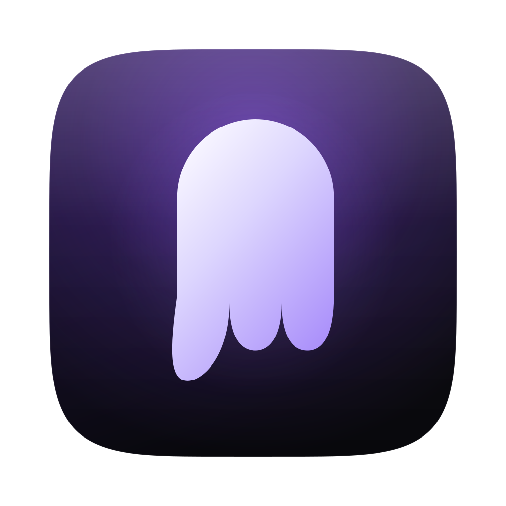

<div align="center">

<br><br>

# Ghostly

Your AI ghostwriter. Just speak.

<br>

<a href="https://github.com/jason-bartz/ghostly/releases/latest">
  
</a>
&nbsp;&nbsp;
<a href="https://github.com/jason-bartz/ghostly/releases/latest">
  
</a>

<br><br>

<sub>macOS 10.15 or later · Apple Silicon &amp; Intel · Transcription runs on-device</sub>

</div>

---

Ghostly lives in your menu bar. Press a shortcut, talk, and your words land in the active app — punctuated, formatted, and shaped to whatever you're writing in. Transcription runs locally; audio never leaves the Mac.

## Install

Grab the latest `.dmg` from [releases](https://github.com/jason-bartz/ghostly/releases/latest), drag Ghostly to Applications, and launch it. It'll ask for microphone and accessibility access, then you can dictate immediately — a starter model ships inside the app. A more accurate one downloads in the background and switches over on its own.

## How it works in practice

Hold the shortcut, talk, release. The transcript pastes into whatever field the cursor is in. Silences get skipped automatically.

Whisper ships as the default. Parakeet (Nvidia) and Moonshine are available if you want faster inference or English-only streaming instead.

## Optional AI cleanup

Connect an API key for OpenAI, Anthropic, Groq, OpenRouter, Cerebras, Z.AI, or any OpenAI-compatible endpoint, and Ghostly runs the transcript through a model before pasting. It fixes punctuation, formats lists, converts spoken numbers to digits ("twenty-five percent" becomes 25%), and strips fillers.

On Apple Silicon you can also pick Apple Intelligence, which runs on-device with no key or network.

Tokens stream into the overlay while the model works. Hit cancel to abort mid-stream.

Without a key configured, nothing breaks — you just get the raw Whisper output.

## Things you can say

"Scratch that" mid-sentence drops everything you said before it, so you can self-correct without re-recording. The phrase is configurable.

Use the edit shortcut to revise your last paste. Press it, say "make it shorter" or "change Monday to Tuesday", and the previous output gets rewritten in place.

Voice commands map spoken phrases to keystrokes — say "approve" to send Enter, "reject" to send Escape. Useful when paired with AI coding agents in Cursor or Claude Code.

The screenshot shortcut grabs the screen, records your question, and pastes a vision model's answer.

## Per-app profiles

Ghostly notices which app has focus when you transcribe and can switch prompts and vocabulary accordingly. A terse prompt for Slack, a formal one for email, a code-aware one for your editor.

## CLI

Install the command from Settings → Developer → Command line, or run the bundle directly once:

```bash
/Applications/Ghostly.app/Contents/MacOS/ghostly --install-cli
```

```bash
ghostly --toggle-transcription   # toggle recording
ghostly --cancel                 # cancel current operation
ghostly --dictate                # record, then print the transcript
ghostly --status                 # idle or recording?
ghostly --history --limit 5      # recent transcriptions
```

`--dictate` prints to stdout and keeps progress on stderr, so dictation composes with anything:

```bash
git commit -m "$(ghostly --dictate)"
```

Useful for foot pedals, Stream Deck, Raycast, Shortcuts, and anywhere the global hotkey gets swallowed — a VM, a remote desktop, a full-screen game.

## Local API

An HTTP server on `127.0.0.1:7543`, off by default, enabled in Settings → Developer. It turns your dictation into something other software can use: sync every transcript to Obsidian, light up a Stream Deck key while recording, or hand your voice to an AI agent.

```bash
curl -X POST http://127.0.0.1:7543/api/dictate \
  -H "Authorization: Bearer $TOKEN" \
  -H "Content-Type: application/json" -d '{"stop_after_ms": 8000}'
```

Endpoints cover status, start/stop/toggle, cancel, dictate, paste, history, and an SSE event stream. Every request needs the per-install token, and requests from web pages are refused outright.

Full reference, including recipes for Raycast, Stream Deck, Obsidian, and Shortcuts: **[docs/API.md](docs/API.md)**.

## Requirements

macOS 10.15 Catalina or later. Apple Silicon recommended; Intel works. Needs microphone and accessibility permissions.

## Credits

Built on [Handy](https://github.com/cjpais/Handy) by CJ Pais, MIT-licensed. See [LICENSE](LICENSE) and [NOTICE.md](NOTICE.md).
